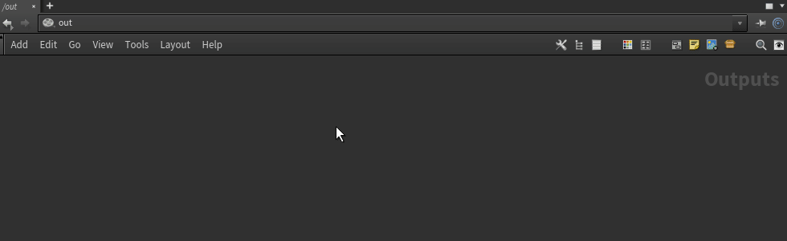
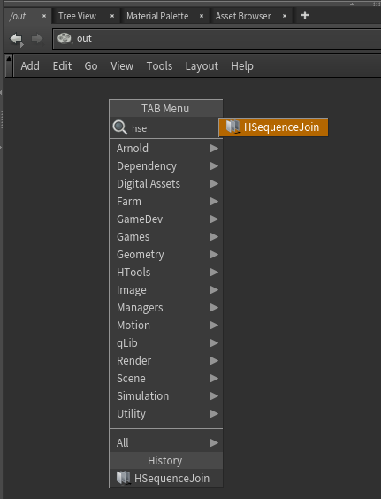
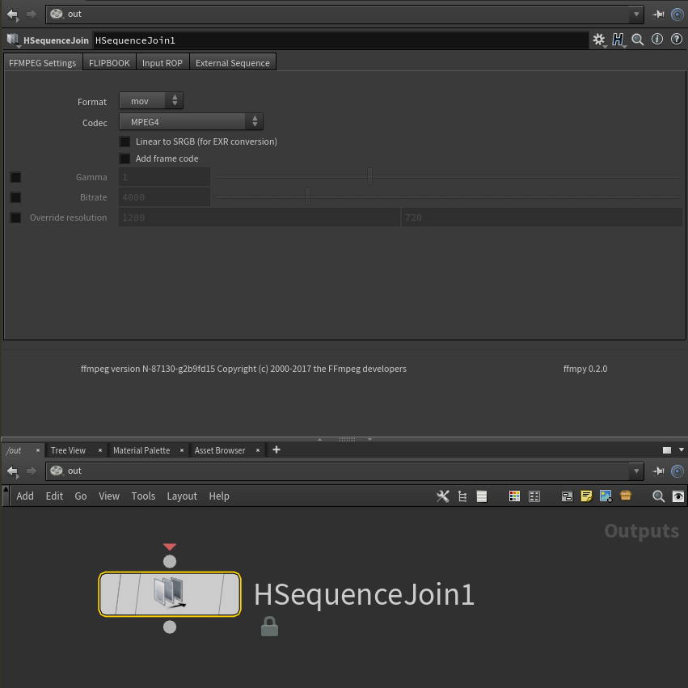

# HSequenceJoin

Houdini ROP asset for joining flipbook or rendered \*.exr, \*.jpg , etc image sequences into video files using ffmpeg

Joins :     
- Rendered sequences to video files using ffmpeg (runs automatically after render complete)
- Flipbook sequences
- External path sequences

If you spot any bugs, please feel free to send me an email at gammany@gmail.com

How to Install:

Copy 'HSequenceJoin.hda' into your scanned assets directory $HOME/houdini/otls
Please wait during the first time creation of the node while it unpacks the ffmpeg file.

Help:

Coming soon
